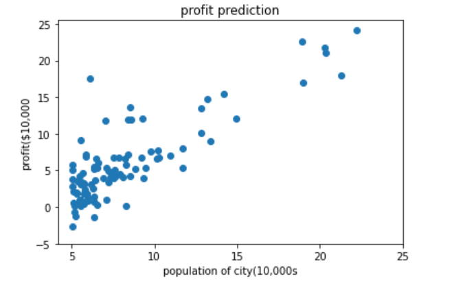
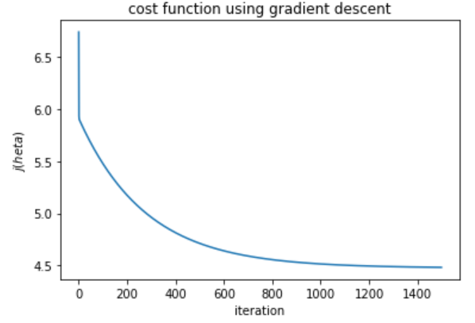
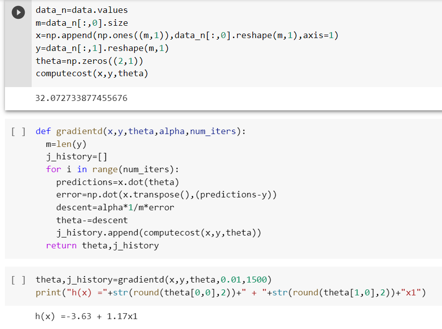
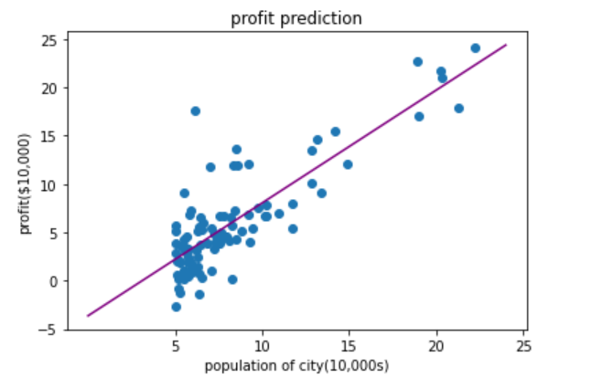
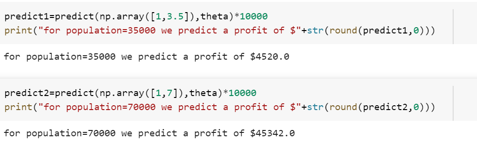

# Implementation-of-Linear-Regression-Using-Gradient-Descent

## AIM:
To write a program to predict the profit of a city using the linear regression model with gradient descent.

## Equipments Required:
1. Hardware – PCs
2. Anaconda – Python 3.7 Installation / Jupyter notebook

## Algorithm
1. Import the dataset and compute the cost     value
2. Calculate the gradient descent
3. Find h(x) equation
4. Plot the cost function using gradient descent
5. Plot the profit prediction graph
6. Check the prediction 

## Program:
```
/*
Program to implement the linear regression using gradient descent.
Developed by: M.Subiksha
RegisterNumber: 212220040162

##Liner regression using gradient descent

import numpy as np
import pandas as pd
import matplotlib.pyplot as plt
data=pd.read_csv('/content/ex1.txt',header=None)
plt.scatter(data[0],data[1])
plt.xticks(np.arange(5,30,step=5))
plt.yticks(np.arange(-5,30,step=5))
plt.xlabel("population of city(10,000s")
plt.ylabel("profit($10,000")
plt.title("profit prediction")
plt.show()
def computecost(x,y,theta):
  m=len(y)
  h=x.dot(theta)
  se=(h-y)**2
  return 1/(2*m)*np.sum(se)
  data_n=data.values
m=data_n[:,0].size
x=np.append(np.ones((m,1)),data_n[:,0].reshape(m,1),axis=1)
y=data_n[:,1].reshape(m,1)
theta=np.zeros((2,1))
computecost(x,y,theta)
def gradientd(x,y,theta,alpha,num_iters):
  m=len(y)
  j_history=[]
  for i in range(num_iters):
    predictions=x.dot(theta)
    error=np.dot(x.transpose(),(predictions-y))
    descent=alpha*1/m*error
    theta-=descent
    j_history.append(computecost(x,y,theta))
  return theta,j_history
  theta,j_history=gradientd(x,y,theta,0.01,1500)
print("h(x) ="+str(round(theta[0,0],2))+" + "+str(round(theta[1,0],2))+"x1")
plt.plot(j_history)
plt.xlabel("iteration")
plt.ylabel("$j(\theta)$")
plt.title("cost function using gradient descent")
plt.scatter(data[0],data[1])
x_value=[x for x in range(25)]
y_value=[y*theta[1]+theta[0] for y in x_value]
plt.plot(x_value,y_value,color="purple")
plt.xticks(np.arange(5,30,step=5))
plt.yticks(np.arange(-5,30,step=5))
plt.xlabel("population of city(10,000s)")
plt.ylabel("profit($10,000)")
plt.title("profit prediction")
def predict(x,theta):
  predictions=np.dot(theta.transpose(),x)
  return predictions[0]
  predict1=predict(np.array([1,3.5]),theta)*10000
print("for population=35000 we predict a profit of $"+str(round(predict1,0)))
predict2=predict(np.array([1,7]),theta)*10000
print("for population=70000 we predict a profit of $"+str(round(predict2,0)))
*/
```

## Output:








## Result:
Thus the program to implement the linear regression using gradient descent is written and verified using python programming.
